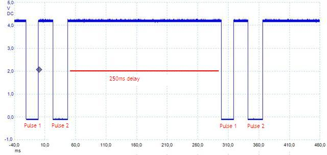

Oil Sensor Emulation - TinyTOG
==============================

Many Audi type 89, B4 and A4 (B5) enthusiasts want to replace their instrument cluster by a more modern one from an A4 (B5) or A6 (C5). Some just want a more modern design. Others want to equip their car with an orignal Audi radio navigation system, called RNS-D.  
The RNS-D was offered by Audi in two major versions. The first one from about 1997 to 1999 communicates with the instrument cluster via a three-wire-bus the latter one from 2000 to about 2003 uses a CAN bus. So different versions of the RNS-D need different versions of the instrument clusters. Mechanically this makes no difference. From the electronics point of view the CAN bus makes a big difference. But this is another story.  
Along with the CAN bus comes another problem to deal with. These CAN instrument clusters do not have a oil temperature gauge powered by a normal sensor. They communicate with an totally different, intelligent sensor called TOG, made by German manufacturer Hella.  
Retrofitting the TOG is not an option, because Audi invented new oil sumps together with the TOG.  
  
  
  
A missing TOG brings up two problems. At first the oil temperature gauge does not work and second the instrument clusters displays a permanent warning message concerning a malfunctioning TOG. This warning cannot be disabled by altering the coding of the instrument clusters. So a different approach had to be taken: TinyTOG.  
  
  
  
The TOG by Hella uses a simple pulse sequence with the time between two pulses and the length of the pulses representing oil temperature and oil condition/quality. As TinyTOG focuses on engines before 2000 (without long life service) only the coding of the oil temperature was analyzed. It turned out that time between the first and the second pulse together with the length of the second pulse represent the oil temperature. The first pulse is constantly 20ms long. The delay between two cycles must be at least 250ms long.  
  
  Temperature | Time between pulses | Length of pulse 2
  ------------- | ------------- | -------------
41°C | 23.0ms | 24.0ms
60°C | 26.3ms | 27.0ms
65°C | 27.0ms | 27.8ms
70°C | 28.0ms | 28.3ms
75°C | 28.5ms | 29.3ms
80°C | 29.3ms | 30.0ms
85°C | 30.3ms | 30.8ms
90°C | 31.0ms | 31.5ms
95°C | 31.8ms | 32.5ms
100°C | 32.5ms | 33.3ms
105°C | 33.3ms | 34.0ms
110°C | 34.0ms | 35.0ms
115°C | 35.0ms | 35.8ms
120°C | 35.8ms | 36.8ms
125°C | 36.8ms | 37.5ms
130°C | 37.5ms | 38.3ms
135°C | 38.3ms | 39.3ms
140°C | 39.3ms | 40.0ms
145°C | 40.0ms | 40.8ms
150°C | 41.0ms | 41.8ms
155°C | 41.8ms | 42.8ms
160°C | 42.8ms | 43.5ms
165°C | 43.5ms | 44.5ms
170°C | 44.5ms | 45.3ms

  
In the 1990s almost all Audis equipped with an oil temperature gauge use an oil temperature sensor, part numer 049 919 6563.  
  
  
  
The analog voltage signal from this sensor has to be translated into the above pulse coded signal understood by the instrument cluster. This is done by Atmel's ATTiny15 with its internal 8Bit-ADC. As the oil temperature is a rather imprecise one a stepping of 5K gives enough precision. The gauge's scale begin's at 60°C. So temperature below that don't have to be measured.  
  
  
  
TinyTOG needs only be connected to ignition, the instrument cluster and the oil temperature sensor. A jumper is provided to bring up a test mode. Normally this jumper should be left open. By shortening to ground and switching on ignition the fuel gauge should travel from 60°C to full scale and reverse as long as ignition stays high.  
The oil temperature sensor together with an 100Ohm potentiometer form a voltage divider. At first time startup the potentiometer should be tuned to about 50Ohm. Minor adjustments could be made by tuning the potentiometer, but in most cases this is not necessary.  

Downloads
---------

  Content       | License
  ------------- | -------------
  [Schematic and Demo Board](https://github.com/BlackBrix/TinyTOG/tree/master/hardware)  | 
  [Source code](https://github.com/BlackBrix/TinyTOG/raw/master/firmware/TinyTOG.asm)  | 
  [Intel HEX File](https://github.com/BlackBrix/TinyTOG/raw/master/firmware/TinyTOG.hex)³  |  
  
³(Internal oscillator calibration set to 0x78)  
