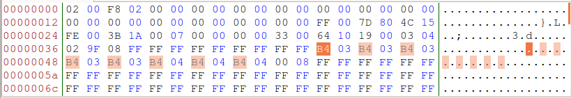

Audi S4 B5 - Kombiinstrument-Umbau von Vor-Facelift zu Facelift
===============================================================

Der Umbau eines Kombiinstruments (KIs) ist eigentlich keine grosse Sache, wird aber, wenn man ein KI eines anderen Fahrzeugtyps oder eines anderen Modelljahrs des gleichen Fahrzeugstyps umbauen möchte, eventuell wesentlich schwieriger. Einer dieser schwierigen Fälle wird hier beschrieben: Tausch eines KI von einem Audi S4 B5 Modelljahr 1999, nachfolgend als Vor-Facelift bezeichnet, mit einem KI aus einem Audi S4 B5 Modelljahr 2000, nachfolgend als Facelift bezeichnet.

Das KI des Vor-Facelift, nachfolgend als altes KI bezeichnet,

*   mit der Teilenummer 8D0 919 881 L
    
*   ist von VDO,
    
*   hat eine Wegfahrsperre der Generation 2 (WFS 2) und
    
*   eine analoge Uhr.
    

Das KI des Facelift, nachfolgend als neues KI bezeichnet,

*   mit der Teilenummer 8D0 920 932 JX
    
*   ist ebenfalls von VDO,
    
*   unterstützt CAN-Bus,
    
*   hat ebenfalls eine WFS 2,
    
*   eine digitale Uhr mit Datumsanzeige und
    
*   eine Anschlussmöglichkeit für eine Funkuhr.
    

Das X am Ende der Teilenummer sagt aus, dass es sich um ein Austauschteil handelt.

Adaption
--------

### Mehrfachstecker

Die Anschlussbuchsen sowie dessen Belegungen unterscheiden sich bei den beiden KIen. Das alte KI hat einen 32-poligen, blauen Anschluss, einen 32-poligen. grünen Anschluss und einen 20-poligen, roten Anschluss. Das neue KI hat ebenfalls den blauen und grünen Anschluss, aber anstelle eines roten Anschlusses einen 32-poligen, grauen Anschluss.

**Übersicht der Belegungen von altem KI zu neuem KI**

Die nachfolgende Tabelle zeigt, wie das neue KI belegt werden muss. Eine Spalte beinhaltet alle Belegungen eines bestimmten Steckers des alten KI und die passende Belegung beim neuen KI. Eine Belegung besteht aus dem Pin und der Farbe des Steckers. In der Spalte auf der linken Seite steht die ursprüngliche Belegung beim alten KI, auf der rechten Seite die passende Belegung bei dem neuen KI.

blauer Stecker | grüner Stecker | roter Stecker
------------- | ------------- | -------------
1 blau → 1 blau | 2 grün → 2 grün | 1 rot → 25 blau 
2 blau → 7 grün | 4 grün → frei | 5 rot → 29 grün 
3 blau → 3 blau | 5 grün → 5 grün | 6 rot → 31 grün 
5 blau → 5 blau | 6 grün → 6 grün | 9 rot → 15 grau 
6 blau → 10 grün | 7 grün → 2 blau | 10 rot → frei 
7 blau → 7 blau | 10 grün → 6 blau | 11 rot → 19 grau 
8 blau → 8 blau | 11 grün → 11 grün | 12 rot → 12 grau 
9 blau → 9 blau | 12 grün → 12 blau | 13 rot → 13 grau 
10 blau → 10 blau | 13 grün → 13 grün | 14 rot → 17 grau 
11 blau → 11 blau | 14 grün → 13 blau | 15 rot → 11 grau 
12 blau → 12 grün | 15 grün → frei | 16 rot → 16 grau 
13 blau → 14 grün | 17 grün → 17 grün | 17 rot → frei 
14 blau → 14 blau | 21 grün → 15 grün | 18 rot → 18 grau 
15 blau → 15 blau | 29 grün → frei | 19 rot → 14 grau 
16 blau → 16 blau | 30 grün → 31 blau |  
17 blau → 17 blau |  |  
18 blau → 18 blau |  |  
19 blau → 21 grün |  |  
20 blau → 20 blau |  |  
21 blau → 21 blau |  |  
22 blau → 22 blau |  |  
23 blau → 23 blau |  |  
24 blau → 24 blau |  |  
25 blau → 28 grün |  |  
26 blau → 26 blau |  |  
27 blau → 27 blau |  |  
28 blau → 28 blau |  |  
29 blau → 29 blau |  |  
30 blau → 30 blau |  |  
31 blau → 27 grün |  |  
32 blau → 32 blau |  |  

*   21 grün vom alten KI ist das Signal des normalen Ölsensors und geht über den TinyTOG zu 15 grün des neuen KIs, um ein TOG-Signal zu emulieren
    

**Benötigte Teile**

Anz. | Bezeichnung | VAG-Teilenummer
----------| --------- | ---------
1x | Stecker grün | 8L0 972 977 C
1x | Stecker blau | 8L0 972 977 D
1x | Stecker grau | 8L0 972 977 G

Die Kabel habe ich aus ein paar Flachbandkabeln, wie sie bei Computern (IDE-/SCSI\-Kabel) verwendet werden, herausgetrennt.

**Abbildung der Rückseite des neuen KIs**

Bei der Belegung des neuen KIs habe ich keine Änderung an den Steckern am Kabelbaum des Fahrzeugs durchgeführt. Damit ist gewährleistet, dass ich jederzeit ein zu dem Modelljahr passendes KI einbauen kann, um den Originalzustand wiederherzustellen.

   

Bei der Belegung ist auf passende Kabellängen zu achten, damit keine Zugbelastungen einzelner Kabel auftreten.

### Temperatur- und Ölstandgeber

Das neue KI hat ein paar mehr Anzeige-Möglichkeiten als das alte KI, sofern entsprechende Sensoren im Fahrzeug verbaut sind, und benötigt einen Temperatur- und Ölstandgeber (TOG), welcher beim Facelift im Zuge der variablen Serviceintervalle (Longlife) eingeführt wurde. Dieser Sensor sitzt beim Facelift auf der Unterseite der Ölwanne, beim Vorface-Lift gibt es diesen Sensor nicht.

Das neue KI wird immer eine Ölstandswarnmeldung anzeigen, wenn es kein plausibles Signal von einem TOG bekommt.

### TinyTOG

Das Signal vom TOG wird mit einer Schaltung, dem TinyTOG von [Automotive Light and Magic (ALM)](http://www.alm.hk/ "http://www.alm.hk"), emuliert. Damit kann der alte Ölsensor (049 919 563 B) weiterverwendet werden und das neue KI zeigt nicht dauerhaft eine Ölstandswarnmeldung an.

Das Herzstück ist ein AVR-Microcontroller, welcher mit dem TinyTOG-Programm die Signale des Ölsensors in TOG-Signale übersetzt. Der Ölsensor gibt die Öltemperatur durch Änderung seines Widerstands an. Der TOG erzeugt wiederkehrend zwei Pulse und eine Pulspause. Die Zeit zwischen den zwei Pulsen und die Länge des zweiten Pulses beschreibt die Öltemperatur.

Der TinyTOG wandelt also den Widerstandswert des Ölsensors in entsprechende Pulse, die ein TOG geben würde, um. Der erste Puls (high = VCC = 5V) ist immer 20 ms lang, die Pause (low = GND = 0V) zwischen erstem und zweiten Puls hat eine Dauer von 23 bis ca. 44 ms, der zweite Puls (high) ist zwischen 24 und 45 ms lang. Das Intervall (low) zwischen den Signalen berägt 250 ms.

Folgende Werte ergeben sich für den Ölsensor (049 919 563 B) zur Messung des Widerstandes und damit der Öltemperatur über einen Spannungsteiler mit einem ATtiny25:

*   50 Ohm-Spannungsteiler
    
*   5 V Referenz- und Versorgungsspannung
    
*   10 Bit-Analog-/Digital-Konverter (ADC)
    

Öltemperatur | Ölsensor | U-variabel | ADC | ADCH | 1\. Puls | Pulspause | 2\. Puls
\[°C\] | \[Ohm\] | \[V\] | (10 Bit) | (8 Bit) | \[ms\] | \[ms\] | \[ms\]
------------ | -------- | ---------- | -------- | -------- | -------- | -------- | -------
41 | 1200 | 4,80 | 983 | 246 | 20,00 | 23,00 | 24,00  
60 | 550 | 4,58 | 939 | 235 | 20,00 | 26,25 | 27,00  
65 | 420 | 4,47 | 915 | 229 | 20,00 | 27,00 | 27,75  
70 | 330 | 4,34 | 889 | 222 | 20,00 | 28,00 | 28,25  
75 | 268 | 4,21 | 863 | 216 | 20,00 | 28,50 | 29,25  
80 | 227 | 4,10 | 839 | 210 | 20,00 | 29,25 | 30,00  
85 | 195 | 3,98 | 815 | 204 | 20,00 | 30,25 | 30,75  
90 | 162 | 3,82 | 782 | 196 | 20,00 | 31,00 | 31,50  
95 | 140 | 3,68 | 755 | 189 | 20,00 | 31,75 | 32,50  
100 | 122 | 3,55 | 726 | 182 | 20,00 | 32,50 | 33,25 
105 | 108 | 3,42 | 700 | 175 | 20,00 | 33,25 | 34,00 
110 | 92 | 3,24 | 663 | 166 | 20,00 | 34,00 | 35,00  
115 | 85 | 3,15 | 645 | 161 | 20,00 | 35,00 | 35,75  
120 | 77 | 3,03 | 621 | 155 | 20,00 | 35,75 | 36,75  
125 | 66 | 2,84 | 583 | 146 | 20,00 | 36,75 | 37,50  
130 | 48 | 2,45 | 502 | 125 | 20,00 | 37,50 | 38,25  
135 | 43 | 2,31 | 473 | 118 | 20,00 | 38,25 | 39,25  
140 | 39 | 2,19 | 449 | 112 | 20,00 | 39,25 | 40,00  
145 | 34 | 2,02 | 414 | 104 | 20,00 | 40,00 | 40,75  
150 | 30 | 1,88 | 384 | 96 | 20,00 | 41,00 | 41,75 
155 | 27 | 1,75 | 359 | 90 | 20,00 | 41,75 | 42,75  
160 | 24 | 1,62 | 332 | 83 | 20,00 | 42,75 | 43,50  
170 | 23 | 1,58 | 323 | 81 | 20,00 | 44,50 | 45,25

Die Schaltung für den TinyTOG kann ohne Probleme auf einer Lochraster-Platine aufgebaut werden.

  

**Benötigte Teile**

Abk. | Anz. | Bezeichnung | Reichelt-Best.-Nr.
-------- | -------- | -------- | --------
JP1-3 | 1x  | 36-pol. Stiftleiste gerade 2,54mm | SL 1X36G 2,54
 .    | 1x | Lochrasterplatine | H25PR200
C1 | 1x | Elektrolyt 0,1µF 100V | RAD 0,1/100  
C2 | 1x | Elektrolyt 220µF 16V | RAD 220/16  
D1 | 1x | Schottky 30V 1A | SB 130  
D4 | 1x | Übersp.-Schutz-Diode | 1,5KE 24A  
F1 | 1x | Rück. Sicherung 40A 60V 3,8s | PFRA 040  
IC2 | 1x | Spannungsregler 5V | LM 2931 AZ  
L1 | 1x | Drosselspule 220µH | SMCC 220µ  
C3 | 1x | Keramik 47pF 50VDC | KERKO 47P  
C4 | 1x | Keramik 100nF 50VDC | KERKO 100N  
D2, D3 | 2x | Schottky 30V 1A | SB 130  
R1 | 1x | Metallschicht 2W 10kOhm | 2W METALL 10K  
R2 | 1x | Präzisionspoti 100Ohm | 64Y-100  
T1 | 1x | N-FET 60V 500mA | BS 170  
IC1 | 1x | Atmel AVR Tiny 25 | ATTINY 25-20 PU  
.   | 1x | IC-Sockel 8-polig | GS 8P  

Das ursprüngliche Programm für den TinyTOG ist von ALM in Assembler geschrieben worden. Die Schaltung ist von 2004 und sieht einen Atmel AVR Tiny 15 (tiny15) als Microcontroller vor, welcher aber nicht mehr hergestellt wird. Als Ersatz bietet sich ein Atmel AVR Tiny 25 (tiny25) an.

Der tiny25 kann in einen tiny15-Kompatibilitätsmodus versetzt werden, welcher den tiny25 quasi zu einem tiny15 umwandelt. Dennoch waren kleine Änderungen an dem originalen TinyTOG-Programm für den Einsatz auf einem tiny25 erforderlich.

*   das ADC Control and Status Register (ADCSR) wude von „ADCSR“ in „ADCSRA“ umbenannt
    
*   die Werte für den 10 Bit-ADC (siehe Tabelle oben) wurden angepasst
    

Das Programm muss auf den tiny25 übertragen werden. Für diesen Zweck kann z. B. WinAVR, welches avrdude beinhaltet, und ein einfacher IC-Programmieradapter (z. B. [SI-Prog](http://www.whoopsie.de/home/doku.php?id=topic02:item004 "topic02:item004")) verwendet werden

Nachfolgend eine Batch-Datei zum Schreiben des tiny25 mit avrdude von WinAVR mit einem SI-Prog.
~~~
@echo off
set port=com1
set prog=siprog
set mmcu=attiny25
set hexfile=TinyTOG
rem # ATtiny25-Fuses
rem 0x62 = Clock: intern 8 MHz, Prescale: 8 (default)
rem 0xE2 = Clock: intern 8 Mhz, kein Prescale
rem 0x63 = Clock: intern 1,6 MHz (tiny15)
set lfuse=0x63
avrdude.exe -p %mmcu% -P %port% -c %prog% -U lfuse:w:%lfuse%:m -U flash:w:%hexfile%.hex:a
~~~

Es können natürlich auch andere Programme (z. B. PonyProg) zum Flashen verwendet werden.

Das TinyTOG-Programm hat ein Demoprogramm integriert, um die Funktion der Schaltung zu überprüfen. Zur Aktivierung des Testprogramms werden die beiden Pins direkt neben dem Microcontroller mittels Jumper verbunden. Bei aktiviertem Testprogramm werden nacheinander Öltemperaturen in 5°C-Schritten simuliert. Beginnend bei 170°C wird ungefähr alle 80 s die simulierte Öltemperatur um 5°C geringer, bis 60°C und im nächsten Schritt 41°C erreicht sind.

Ein 100 Ohm-Präzisionspoti dient zur Feinjustierung. Da in der kleinen Öltemperaturanzeige im KI ohnehin nur eine ungefähre Anzeige möglich ist, sollte ein Wert von 50 Ohm in den meisten Fällen ausreichend genau sein.

Die Spannungsversorgung sollte über Klemme 15 (Zündungsplus) und Klemme 31 (Lastmasse) erfolgen. Beim alten und neuen KI liegt

*   Klemme 15 auf 1 blau und
    
*   Klemme 31 z. B. auf 9 blau.
    

Wegfahrsperre
-------------

Eine WFS ist ein verbundenes Sicherheitssystem im Fahrzeug, welche das unerlaubte Starten des Motors verhindern soll und erstreckt sich über

*   das Motorsteuergerät,
    
*   das Kombinstrument oder einer seperaten, eigenen Einheit und
    
*   den Schlüsseln.
    

Es ist grundsätzlich möglich ein KI mit WFS 2 oder WFS 3 in ein Fahrzeug mit WFS 2 zu verbauen. Ein KI mit WFS 2 hat nur seine 14-stellige ID gespeichert. Bei WFS 3 werden zusätzlich die 17-stellige Fahrgestellnummer, welche ebenfalls im Motorsteuergerät gespeichert ist, und Informationen zum Hersteller, Fahrzeugtyp, Modelljahr und das Herstellwerk gespeichert. Die WFS 2 wurde beim Audi S4 B5 von 1997 bis ca. 2001 verbaut.

Das neue KI muss nach dem Einbau

*   an das Motorsteuergerät angeglichen werden und
    
*   die zum Starten berechtigten Schlüssel angelernt bekommen.
    

Das Anlernen und Angleichen kann z. B. mit VCDS durchgeführt werden.

### Schlüssel anlernen

Voraussetzung: Das neue KI ist eingebaut und der Login-Code für das neue KI ist bekannt.

In meinem Fall hatte ich nicht den Login-Code zu dem neuen KI. Es gibt aber günstige Programme wie z. B. VAGTacho, welche über einen eigenen OBD-Stecker den Login eines KIs bis ca. Baujahr 2002 auslesen können. Ich selber habe das Programm auch genutzt, allerdings funktionierte es nur bei dem alten KI, nicht aber bei dem neuen KI. Es half nur das direkte Auslesen des EEPROMs.

Steuergerät: Schalttafeleinsatz / Kombiinstrument

*   \[Login - 11\] → fünfstelligen Login-Code des neuen KIs eingeben (z. B. für Login-Code 1234 = 01234)
    
*   \[Anpassung - 10\] → Anpassungskanal 21 auslesen
    
    *   Der gespeicherte und angezeigte Wert ist die Anzahl der alten, angelernten Schlüssel. Der Wert wird auf 0 gesetzt und gespeichert, damit die alte Schlüsselzuordnung gelöscht wird. Anschliessend wird die neue Anzahl der anzulernenden Schlüssel eingegeben und gespeichert. Nach der Speicherung ist der erste Schlüssel angelernt und die Kontrollleuchte der Wegfahrsperre im KI sollte erlischen.
        
    *   Ein neuer, anzulernender Schlüssel wird in das Zündschloss gesteckt und die Zündung einschaltet. Die Kontrollfeuchte der Wegfahrsperre schaltet sich für ca. 2 Sekunden ein und erlischt dann wieder. Der Schlüssel ist angelernt. Der Vorgang wird für alle anzulernenden Schlüssel wiederholt.
        

### Motorsteuergerät angleichen

Steuergerät: Schalttafeleinsatz / Kombiinstrument

*   \[Login - 11\] → fünfstelligen Login-Code des neuen KIs eingeben (z. B. für Login-Code 1234 = 01234)
    
*   \[Anpassung - 10\] → Anpassungskanal 0 auslesen und speichern, um das Motorsteuergerät mit dem KI bekannt zu machen
    

Login-Code und Laufleistung
---------------------------

Der 93lc86 ist ein serieller Microwire-EEPROM mit 2 kByte Speicher. Dieser EEPROM wird bei dem neuen KI zur Speicherung von u. a. Login-Code und Laufleistung genutzt, welche je nach Baujahr, Hersteller und WFS-Generation dort in irgendeiner Form abgelegt sind.

Um auf den EEPROM zugreifen zu können muss das KI geöffnet werden und mit einem IC-Programmieradapter, z. B. dem [SI-Prog](http://www.whoopsie.de/home/doku.php?id=topic02:item004 "topic02:item004") verbunden werden. Mit einem passenden Programm, z. B. PonyProg, kann dann der Inhalt des EEPROMs, der Dump, ausgelesen werden.

Der Dump kann als Datei gespeichert und anschließend mit einem Hex-Editor geöffnet werden. Im Hex-Editor werden 16 Bit üblicherweise hexadezimal mit vier Zeichen (jeweils von 0 bis 9, dann A bis F für dezimal 0 bis 15) angezeigt.

Der Dump ist korrekt, wenn man irgendwo im Hex-Editor eine 14-stellge WFS-ID und die Teilenummer des KIs erahnen kann.

Es gibt Programme, z. B. IMMOread by Gsmservis, welche Login-Codes aus solchen Dumps auslesen können. Für meinen Dump hat das Programm allerdings nicht funktioniert.

### Login-Code auslesen

Der Login-Code steht an der Stelle 0x7E2 dreimal hintereinander in 16 Bit Länge.

Die hexadezimale Darstellung muss lediglich in eine dezimale Darstellung gebracht werden.

*   0x000_2_ = 2 \* 16^0 = 2 \* 1 = 2
    
*   0x00_D_0 = 13 \* 16^1 = 13 \* 16 = 208
    
*   0x0_4_00 = 4 \* 16^2 = 4 \* 256 = 1024
    
*   0x_0_000 = 0 \* 16^3 = 0 \* 4096 = 0
    

Die dezimale Darstellung von 0x04D2 und damit der Login-Code ist 0 + 1024 + 208 + 2 = 1234.

Der Login-Code hat fast immer einen 4-stelligen Wert, muss aber in VCDS 5-stellig, hier also mit führender Null, eingegeben werden.

### Laufleistung ändern

Mit VCDS ist aus Sicherheitsgründen nur eine Anpassung eines km-Stands von unter 100 km möglich. Ein gebrauchtes KI, welches typischerweise aus einem anderen Fahrzeug ausgebaut wurde, hat in den allermeisten Fällen einen höheren km-Stand gespeichert. Eine Anpassung des km-Stands mit VCDS ist dann nicht möglich.

**Berechnung der Laufleistung**

Die Laufleistung wird hier exemplarisch ermittelt und beträgt 311.177 km. Sie wird an der Stelle 0x42 in 8 mal 16 Bit Länge im EEPROM gehalten.

Zuerst werden die beiden 16 Bit-Pakete in ihre dezimale Darstellung überführt, wobei 0xB403 fünfmal und 0xB404 dreimal vorkommt. Der Einfachheit halber braucht nur ein 16 Bit-Paket überführt werden, da das jeweils andere Paket entweder einen um den Wert 1 höheren oder niedrigeren Wert hat.

*   0x000_3_ = 3 \* 16^0 = 3 \* 1 = 3
    
*   0x00_0_0 = 0 \* 16^1 = 0 \* 16 = 0
    
*   0x0_4_00 = 4 \* 16^2 = 4 \* 256 = 1.024
    
*   0x_B_000 = 11 \* 16^3 = 11 \* 4096 = 45.056
    

Die hexadezimalen Werte 0xB403 bzw. 0xB404 entsprechen den dezimalen Werten 45.056 + 1.024 + 0 + 3 = 46.083 bzw. 46.083 + 1 = 46.084.

Definierte Werte:

*   a1 := dezimaler Wert des ersten 16 Bit-Pakets
    
*   a2 := dezimaler Wert des zweiten 16 Bit-Pakets
    
*   n1 := Anzahl des ersten 16 Bit-Pakets
    
*   n2 := Anzahl des zweiten 16 Bit-Pakets
    
*   x = 49
    
*   y = (n1+n2) \* 65.535 = 8 \* 65.535 = 524.280
    

Rechenschema:

*   a1 = 46.083
    
*   a2 = 46.084
    

*   b1 = n1 \* a1 = 5 \* 46.083 = 230.415
    
*   b2 = n2 \* a2 = 3 \* 46.084 = 138.252
    

*   b = b1 + b2 = 368.667
    
*   c = y - b = 155.613
    
*   d = c \* 2 = 311.226
    
*   e = d - 49 = 311.177
    

Der Wert e entspricht der Laufleistung in km.

**Anpassung der Laufleistung**

Die Änderung erfolgt im Dump, also in dem EEPROM-Abbild, welcher nach der Änderung zurück in den EEPROM geschrieben wird.

Exemplarisch wird hier die Laufleistung auf 261.039 km geändert. Dazu muss die Laufleistung wie o. a. nur in umgekehrter Reihenfolge in die hexadezimale Darstellung überführt werden.

Definierte Werte:

*   e := Wert der Laufleistung in Kilometer
    
*   n := Anzahl der darzustellenden 16 Bit-Pakete
    
*   x = 49
    
*   y = n \* 65.535 = 8 \* 65.535 = 524.280
    

Rechenschema:

*   e = 261.039
    
*   d = e + x = 261.088
    
*   c = d / 2 = 130.544
    
*   b = y - c = 393.736
    

Überführung in acht 16 Bit-Pakete:

*   a = b / n = 393.736 / 8 = 49.217
    

Umformung von dezimaler in hexadezimale Darstellung:

*   49.217 / 16 = 3.076 , Rest 1
    
*   3.076 / 16 = 192 , Rest 4
    
*   192 / 16 = 12 , Rest 0
    
*   12 / 16 = 0 , Rest 12 = C
    

Der dezimale Wert 49.217 entspricht dem hexadezimalen Wert 0xC041.

In diesem Dump wurde der Wert 0xC041 in Big-Endian gespeichert, d. h. erst C0 und dann 41. In Little-Endian werden zuerst die niederwertigsten Bits gespeichert, dort wäre zuerst 41 und dann C0 gespeichert.

Downloads
---------

*   [TinyTOG für ATtiny25 (zip)](http://www.whoopsie.de/home/lib/exe/fetch.php?media=topic03:item003:kombi_tinytog_attiny25.zip "topic03:item003:kombi_tinytog_attiny25.zip")
    

Quellen
-------

*   [http://www.alm.hk/tiny/tinytog.php](http://www.alm.hk/tiny/tinytog.php "http://www.alm.hk/tiny/tinytog.php") - Automotive Light and Magic / Oil Sensor Emulation
    
*   [http://www.gti-tdi.de/board2/index.php](http://www.gti-tdi.de/board2/index.php "http://www.gti-tdi.de/board2/index.php") - Dashboard Forum
    
*   [http://www.motor-talk.de/blogs/spatwitz/umbau-auf-tt-tacho-t2587381.html](http://www.motor-talk.de/blogs/spatwitz/umbau-auf-tt-tacho-t2587381.html "http://www.motor-talk.de/blogs/spatwitz/umbau-auf-tt-tacho-t2587381.html") - Umbau TT-Tacho in Golf III
    
*   [http://www.michaelneuhaus.de/forum/viewtopic.php?f=6&t=2630#p15707](http://www.michaelneuhaus.de/forum/viewtopic.php?f=6&t=2630#p15707 "http://www.michaelneuhaus.de/forum/viewtopic.php?f=6&t=2630#p15707") - TT-Tacho Umbau in Golf III/IV
    
*   [www.lutschi.biz/navi/Audi/umbau\_kombiinstrument.pdf](http://www.lutschi.biz/navi/Audi/umbau_kombiinstrument.pdf "http://www.lutschi.biz/navi/Audi/umbau_kombiinstrument.pdf") - Umbau KI A6 C5 2.5 TDI von 3-Leiter-Bus auf CAN-Bus
    

Links
-----

*   [http://www.lancos.com/prog.html](http://www.lancos.com/prog.html "http://www.lancos.com/prog.html") - PonyProg
    
*   [http://winavr.sourceforge.net/](http://winavr.sourceforge.net/ "http://winavr.sourceforge.net/") - WinAVR
    
*   [http://www.zeitnitz.de/Christian/scope\_de](http://www.zeitnitz.de/Christian/scope_de "http://www.zeitnitz.de/Christian/scope_de") - Soundcard Scope
